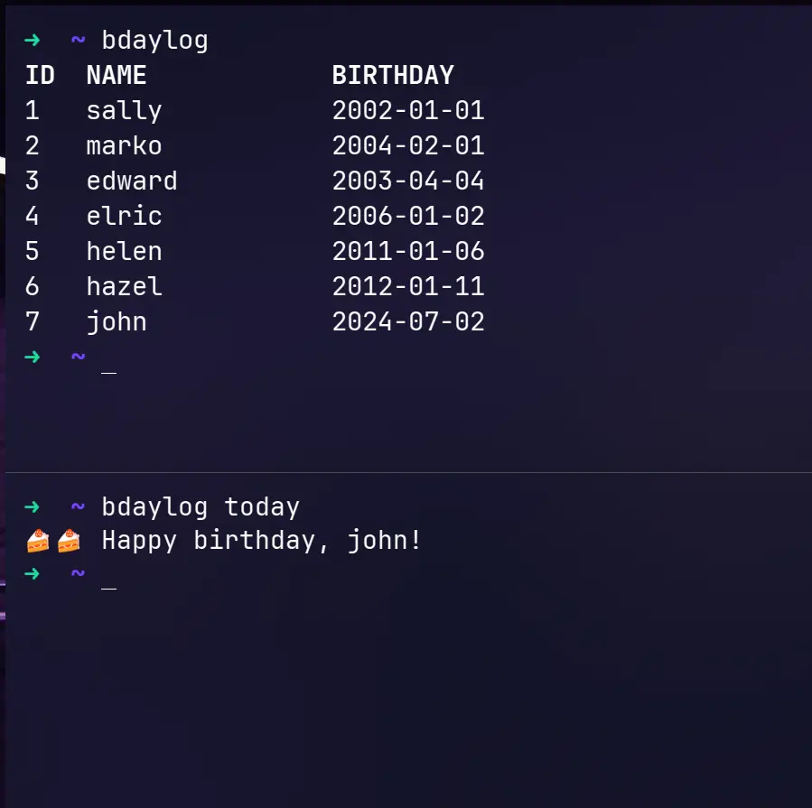

# bdaylog-rs



a dead-simple tool made for myself to list birthdays, as i'm exceptionally bad at remembering them.

## usage

```
list - lists all birthdays
add - add new birthday
update - update birthday details
delete - delete a birthday

today - check if there's a birthday today
search - search a birthday
help - print this text
```

## build instructions

```bash
$ cargo build --release
# binary will be in target/release
```

## dependencies

- [chrono](https://crates.io/crates/chrono)
- [regex](https://crates.io/crates/regex)
- [rusqlite](https://crates.io/crates/rusqlite)